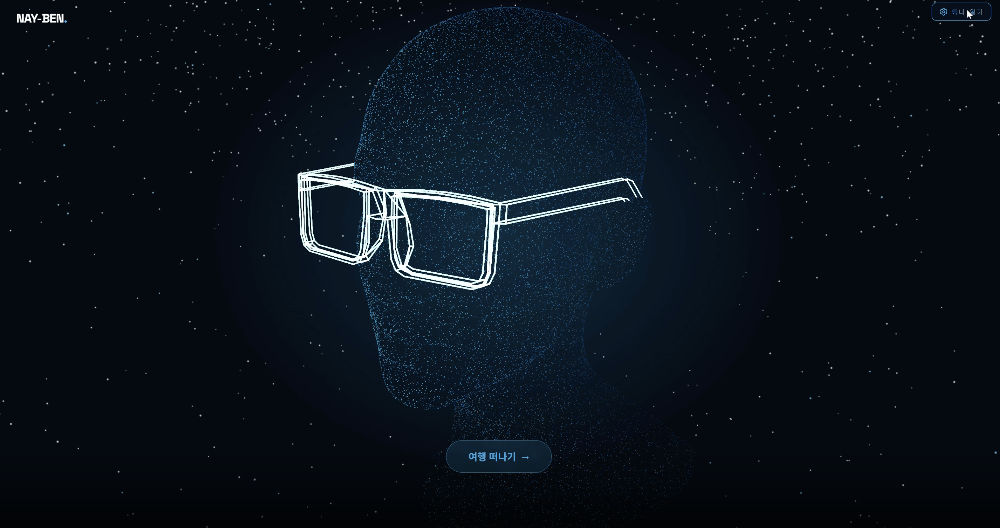
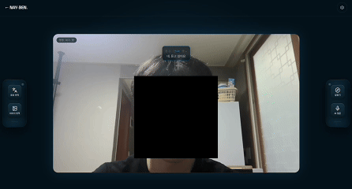
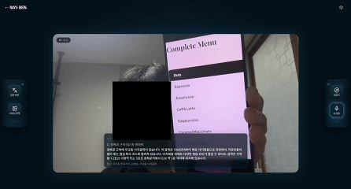
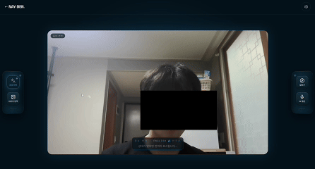
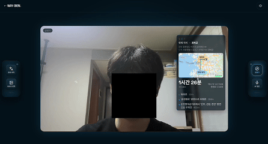
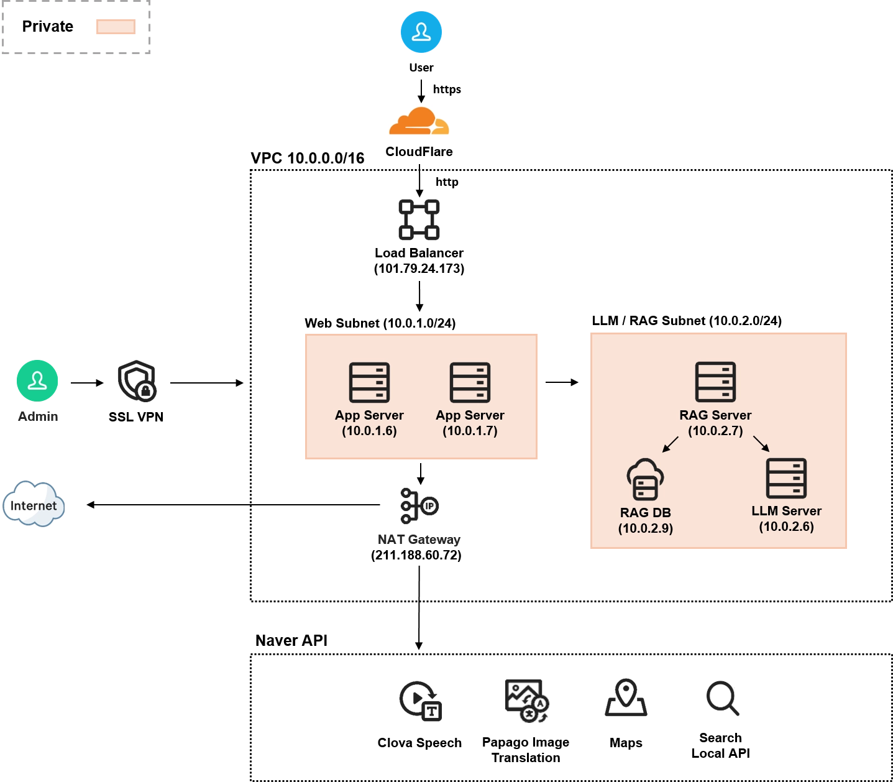

# 스마트 글래스 시뮬레이션

여행자를 위한 스마트 글래스(웨어러블 AR 글래스) 경험을 웹캠 기반으로 시뮬레이션하는 프로젝트입니다.
음성 명령 하나로 길찾기·이미지 번역·실시간 통역·여행지 질문응답을 오버레이 UI로 보여줍니다.
데모 여행지는 **서울**로 고정되어 있습니다.


## 데모



**길찾기**



**이미지 번역**



**대화 통역**



**질문응답 (RAG)**



## 핵심 기능

음성으로 호출어("헤이 글래스")를 부른 뒤 명령하면, 서버가 명령을 인식해 해당 기능을 실행하고 결과를 웹캠 화면 위 오버레이로 보여줍니다.

- **음성 명령 인식 / 실시간 자막** — CLOVA Speech 기반, WebSocket 하나로 명령어 감지까지 처리
- **길찾기** — 목적지를 말하면 네이버 지도 API로 경로·거리·예상 택시비 안내
- **이미지 번역** — "메뉴판 번역해줘" 등 카메라 화면 속 글자를 인식해 번역 이미지로 반환 (Papago)
- **대화 통역** — 외국인과의 대화(영어)를 실시간으로 인식해 한국어 번역과 함께 자막 표시
- **여행지 질문응답** — 서울 관광지/맛집 관련 질문에 RAG(벡터 검색 + LLM) 기반으로 답변

## 아키텍처



## 담당 (윤태준 — 팀장 / 백엔드)

이 저장소에서 아래 항목을 맡았습니다.

- **인프라·서버 아키텍처 설계** — 모듈 단위 폴더 구조, 공통 응답 포맷, 라우터 자동 등록 방식 ([`server/main.py`](server/main.py))
- **web과 연결되는 API 설계/구현** — REST + WebSocket 엔드포인트, 음성 명령 실행 흐름 ([`server/service.py`](server/service.py))
- **지도 기능 구현** — 장소 검색, 지오코딩, 경로 계산 ([`server/modules/map`](server/modules/map))
- **이미지 번역 구현** — 카메라 화면 텍스트 인식·번역 ([`server/modules/imgPapago`](server/modules/imgPapago))
- **RAG API 로직 구현** — 별도 RAG 서버로 질의를 위임하는 프록시 ([`server/modules/rag`](server/modules/rag)), 벡터 DB 구축은 제외
- **배포 자동화** — 서버 셋업/배포 스크립트 ([`install.sh`](install.sh), [`setup.sh`](setup.sh))
- **모듈 작성 규칙 및 API 문서화** — [`server/API.md`](server/API.md), [`server/modules/README.md`](server/modules/README.md)

### 팀

| 이름 | 역할 |
|---|---|
| 윤태준 (팀장) | 백엔드 아키텍처, 지도·이미지 번역·RAG 연동, 배포, 문서화 |
| 최현우 | 프론트엔드/UI ([`web`](web)) |
| 지유찬 | 음성 인식/STT ([`server/modules/stt`](server/modules/stt)) |
| 박찬영 | LLM 서버 ([`llm`](llm)), RAG 로직 및 벡터 DB 구축 ([`rag`](rag)) |
| 김진현 | 인프라 |

## 폴더 구조

- [`server`](server) — API 서버 (FastAPI). 외부 API 연동은 [`server/modules`](server/modules) 아래 모듈 단위로 작성
- [`web`](web) — 프론트엔드 (React + Vite)
- [`llm`](llm) — 대화형 답변 생성 서버 (Ollama 연동)
- [`rag`](rag) — 여행지 질문응답용 RAG 서버 (pgvector 벡터 검색)

## 실행 방법

```bash
# server
cd server
python3 -m venv .venv && source .venv/bin/activate
pip install -r requirements.txt
cp .env.example .env       # 키 입력
uvicorn main:app --reload

# web (다른 터미널)
cd web
npm install
npm run dev
```

각 폴더의 상세 실행 방법·환경변수는 해당 폴더 README를 참고하세요.

## 문서

- [server/API.md](server/API.md) — 클라이언트가 호출하는 REST/WebSocket 전체 스펙
- [rag/API.md](rag/API.md) — RAG 서버 자체 API 스펙
- [server/README.md](server/README.md), [server/modules/README.md](server/modules/README.md) — 서버 실행 방법, 모듈 작성 규칙
- [web/README.md](web/README.md), [llm/README.md](llm/README.md), [rag/README.md](rag/README.md)

## 서버 배포

운영 서버 셋업/배포는 스크립트 2개로 자동화되어 있습니다. 재실행해도 안전합니다(이미 되어있는 단계는 건너뜀).

- `install.sh` — 저장소 클론(또는 git pull), python3/venv·의존성 설치, `.env` 준비까지. `server/.env`, `web/.env`에 키 입력 전까지 진행합니다.
- `setup.sh` — `install.sh` 이후, 키를 채운 상태에서 실행. 의존성 재동기화, 프론트 프로덕션 빌드, backend/frontend systemd 서비스 등록·기동까지 합니다. HTTPS(Cloudflare 터널)는 기본 꺼져 있음 — 서버가 여러 대(LB 뒤)면 파일 하단 안내대로 그중 한 곳에서만 켭니다.

```bash
sudo bash install.sh
# server/.env, web/.env 에 키 입력 후
sudo bash setup.sh
```
